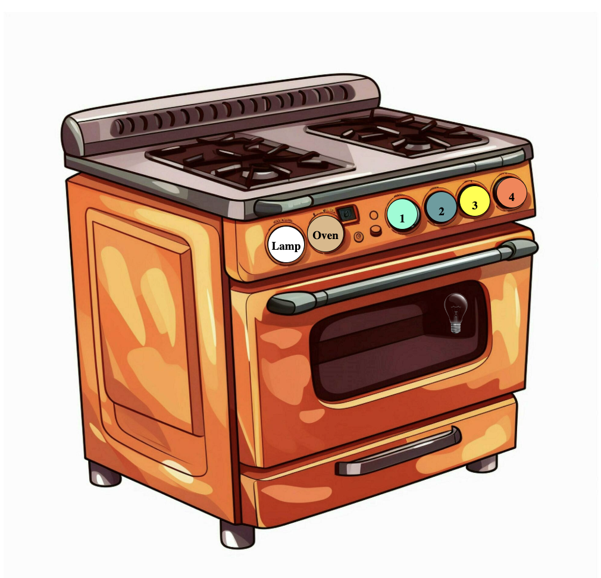

## Projeto de manipulação do DOM com Javascript (ES6)
Para acessar, basta abrir /public/index.html

Os queimadores e lâmpada são dinâmicos e podem ter seus estados alterados com o clique sobre os acendedores. Todo o projeto foi feito utilizando classes do javascript, priorizando o uso de POO e herança.

